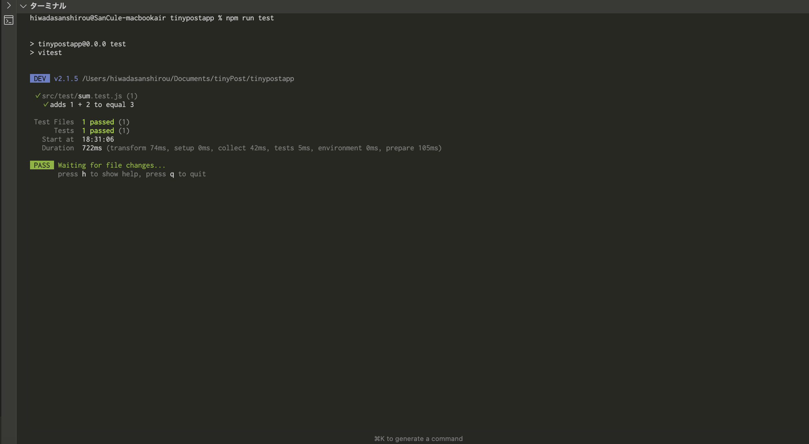
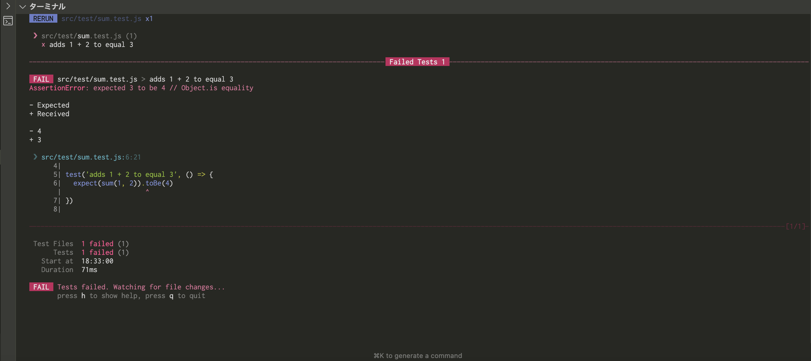
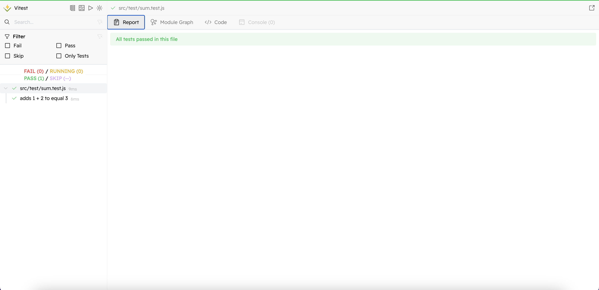
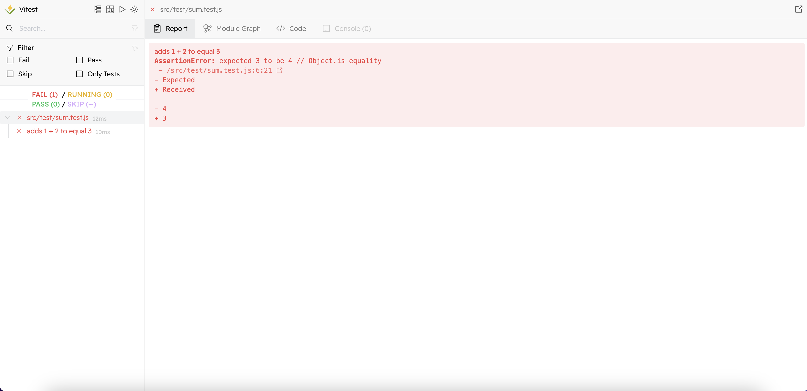

# ユニットテスト手順

1. `src/test`ディレクトリ配下に`【yourFileName】.test.js`を作成
2. テストしたい項目を記載
```
//これはサンプルです。
import { expect, test } from 'vitest'

import { sum } from '../utils/sum.js'

test('adds 1 + 2 to equal 3', () => {
  expect(sum(1, 2)).toBe(3)
})

```
3. 下記コマンドを実行
```
npm run test
```
下記のような画面が表示されればOK！


エラーの時はこんな感じ！

※GUIで確認したい場合
```
npm run test:ui
```

下記のような画面が表示されればOK！


エラーの時はこんな感じ！

